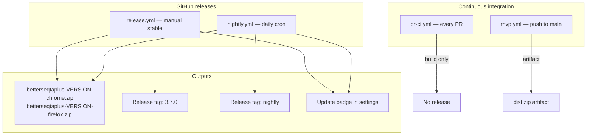

# GitHub releases, CI, and the update detector

BetterSEQTA+ is distributed on the Chrome Web Store and Firefox Add-ons, but some users sideload builds from GitHub. This document explains how automated builds, releases, and the in-extension update badge work.

All published releases target the upstream repository: **[BetterSEQTA/BetterSEQTA-Plus](https://github.com/BetterSEQTA/BetterSEQTA-Plus)**.

---

## Overview



| Workflow | Trigger | Creates a release? | Update detector in build? |
|----------|---------|------------------|---------------------------|
| `pr-ci.yml` | Every pull request to `main` | No | No |
| `mvp.yml` | Every push to `main` | No | No |
| `release.yml` | Manual (`workflow_dispatch`) | Yes — stable version tag | Yes — stable channel |
| `nightly.yml` | Daily at 03:00 UTC + manual | Yes — reuses `nightly` tag | Yes — nightly channel |

---

## Shared build action

All release and CI builds that need packaged extensions use the composite action at [`.github/actions/build-extension/action.yml`](../.github/actions/build-extension/action.yml).

It:

1. Installs dependencies (`npm install --legacy-peer-deps`)
2. Runs `npm run build` (Chrome then Firefox via Vite)
3. Zips each unpacked folder into sideload-ready archives:
   - `dist/betterseqtaplus-{version}-chrome.zip`
   - `dist/betterseqtaplus-{version}-firefox.zip`

The `{version}` comes from `package.json`.

### Build-time flags (release builds only)

Release and nightly workflows pass environment variables into Vite, which bakes them into the extension at compile time via `define` in [`vite.config.ts`](../vite.config.ts):

| Variable | Stable release | Nightly | PR / local dev |
|----------|----------------|---------|----------------|
| `GH_RELEASE_UPDATE_CHECK` | `true` | `true` | `false` / unset |
| `UPDATE_CHANNEL` | `stable` | `nightly` | `stable` (unused) |
| `GH_RELEASE_REPO` | `BetterSEQTA/BetterSEQTA-Plus` | same | same |
| `BUILD_LABEL` | empty | GitHub run number | empty |

When `GH_RELEASE_UPDATE_CHECK` is not `true`, the update-checker code is tree-shaken out of the bundle. PR CI builds and local `npm run build` do **not** include the update badge.

To test a release-style build locally:

```bash
# PowerShell
$env:GH_RELEASE_UPDATE_CHECK="true"
$env:UPDATE_CHANNEL="stable"
npm run build

# bash
GH_RELEASE_UPDATE_CHECK=true UPDATE_CHANNEL=stable npm run build
```

---

## Stable release (`release.yml`)

**Purpose:** A safe, manual way to publish versioned builds that users can download from GitHub.

**Trigger:** Manual only — Actions → **Release** → **Run workflow**. There is no schedule or automatic trigger.

When dispatching, check **“I have already updated the version in package.json”**. The workflow will not run without that confirmation.

### Before you run it

1. Merge your changes to `main`.
2. Bump `version` in [`package.json`](../package.json) (e.g. `3.7.0` → `3.8.0`).
3. Commit and push that bump.

### What the workflow does

1. Aborts if the version confirmation was not checked.
2. Reads the version from `package.json`.
3. Builds Chrome and Firefox with the update detector enabled (stable channel).
4. If no release exists for that tag: creates one (e.g. `3.8.0`) with a placeholder description.
5. If a release already exists for that tag: **only replaces the zip assets** (`--clobber`). Title and body are left unchanged.
6. Uploads `betterseqtaplus-{version}-chrome.zip` and `-firefox.zip`.

On first publish, edit the **title** and **release notes** on GitHub afterward. Re-running for the same version refreshes the files only.

### Downloading and installing

1. Open [github.com/BetterSEQTA/BetterSEQTA-Plus/releases](https://github.com/BetterSEQTA/BetterSEQTA-Plus/releases).
2. Pick the version you want.
3. Download `betterseqtaplus-{version}-chrome.zip` or `-firefox.zip`.
4. Unzip and load the unpacked folder as a temporary extension (Chrome: Extensions → Load unpacked; Firefox: `about:debugging` → Load Temporary Add-on).

**These GitHub builds are for sideloading only. Do not upload them to the Chrome Web Store or Firefox Add-ons.**

---

## Nightly release (`nightly.yml`)

**Purpose:** Continuous experimental builds from `main` so testers always have a single place to get the latest code.

**Trigger:**

- Automatically every day at **03:00 UTC**
- Manually via Actions → **Nightly Release** → **Run workflow**

### What the workflow does

1. Builds from the current `main` branch with the update detector enabled (nightly channel).
2. Uses a fixed release tag: **`nightly`** (marked as prerelease).
3. On first run: creates the `nightly` release with the text in [`.github/nightly-release-notes.md`](../.github/nightly-release-notes.md).
4. On every subsequent run: **replaces** the zip assets on the same release (`--clobber`). The release title and body are not rewritten.

The nightly release body warns that builds are experimental and must not be uploaded to extension stores.

---

## PR CI (`pr-ci.yml`)

**Purpose:** Verify that every pull request builds cleanly in a fresh environment.

**Trigger:** Every pull request targeting `main`.

**Steps:**

1. `npm install --legacy-peer-deps`
2. `npm run lint` (ESLint on `src/**/*.{js,ts}`)
3. Build via the shared action with **no** update detector

No release is created and no artifacts are published for end users.

---

## Push CI (`mvp.yml`)

**Purpose:** Build verification when code lands on `main`.

**Trigger:** Push to `main` only (not pull requests — those use `pr-ci.yml`).

Uploads a `dist.zip` artifact containing the full `dist/` folder for debugging. No release, no update detector.

---

## Authentication

Release workflows run **only on [BetterSEQTA/BetterSEQTA-Plus](https://github.com/BetterSEQTA/BetterSEQTA-Plus)**. They use the default `GITHUB_TOKEN` with `contents: write` — no extra secrets or PATs required.

---

## Update detector (in-extension)

GitHub release builds include a small feature that tells sideload users when a newer build is available, so they do not have to check GitHub manually.

### Where it appears

In the **settings popup** header (top-right): an amber **“Update available — X.X.X”** pill when an update exists, plus a muted line:

> GitHub release build — do not upload to extension stores.

Clicking the badge opens the relevant GitHub releases page.

### How it checks for updates

Implementation: [`src/utils/githubReleaseUpdate.ts`](../src/utils/githubReleaseUpdate.ts)

**Stable channel** (from `release.yml` builds):

1. Fetches releases from the GitHub API for `BetterSEQTA/BetterSEQTA-Plus`.
2. Ignores the `nightly` tag and any non-semver tags.
3. Finds the highest semver tag.
4. Compares it to `browser.runtime.getManifest().version`.
5. Shows the badge if the remote version is newer.

**Nightly channel** (from `nightly.yml` builds):

1. Fetches the `nightly` release.
2. Compares its `published_at` timestamp to `lastSeenNightlyPublishedAt` in extension storage.
3. On first install, records the current publish time without showing a badge.
4. Shows **“Update available — nightly #123”** (run number) when a newer nightly has been published.

Checks are throttled to once every **6 hours** per browser profile (`localStorage` key `bsplus_lastGhReleaseCheck`). Recent results are cached in memory for the session.

### Dev override (testing)

To test the badge without publishing a real release:

1. Open settings and unlock **dev mode** (click the logo, type `dev`).
2. In the developer section, set **GitHub latest version override** to a version higher than your installed one (e.g. `9.9.9`).
3. Reopen settings — the badge should appear.

This only applies when dev mode is on. Clear the field to return to normal API checks.

---

## File reference

| Path | Role |
|------|------|
| `.github/actions/build-extension/action.yml` | Shared install, build, zip |
| `.github/workflows/release.yml` | Manual stable releases |
| `.github/workflows/nightly.yml` | Nightly releases |
| `.github/workflows/pr-ci.yml` | PR lint + build |
| `.github/workflows/mvp.yml` | Push-to-main build artifact |
| `.github/nightly-release-notes.md` | Static body for the `nightly` release |
| `vite.config.ts` | Injects build-time `define` flags |
| `src/env.d.ts` | TypeScript declarations for those flags |
| `src/utils/githubReleaseUpdate.ts` | Update check logic |
| `src/interface/pages/settings.svelte` | Badge and disclaimer UI |
| `src/interface/pages/settings/general.svelte` | Dev override input |
| `src/types/storage.ts` | `devGhReleaseVersionOverride`, `lastSeenNightlyPublishedAt` |

---

## Quick reference

### Publish a stable release

```text
1. Bump version in package.json on main
2. Actions → Release → Run workflow → confirm version checkbox
3. Edit release title/notes on GitHub (first time only)
4. Re-run with same version to refresh zips without changing release text
```

### Get the latest nightly

```text
https://github.com/BetterSEQTA/BetterSEQTA-Plus/releases/tag/nightly
```

### Verify a PR locally

```bash
npm run lint
npm run build
```
